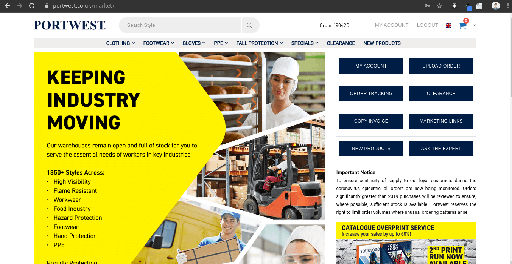

Portwest Products Scraper

> Extracts all products on portwest.co.uk site into a csv file

[![NPM Version][npm-image]][npm-url]

[![Downloads Stats][npm-downloads]][npm-url]



## Installation

Without docker:

```sh
git clone https://github.com/ztobs/portwest-scraper-js.git
cd portwest-scraper-js
nano pw_credentials.json
{
  "email": "xxx",
  "password": "xxxxxxxxx"
}
npm install
npm run scrap
```

With Docker:

```sh
git clone https://github.com/ztobs/portwest-scraper-js.git
docker build -t pwscraper .
docker run -it pwscraper
cd ~/portwest-scraper-js
nano pw_credentials.json
{
  "email": "xxx",
  "password": "xxxxxxxxx"
}
npm run scrap
```

## Usage

- You obviously need git installed on your machine
- for running with docker, you need dont need npm installed on your machine
- pay attension to the part where you have to create the pw_credential.json file and add your login credentils
- the exported files will be in the generated/ folder

## Release History

- 0.0.1
  - Work in progress

## Meta

Your Name – [@dadonztobs](https://twitter.com/dadonztobs) – ztobscieng@gmail.com

[https://github.com/ztobs/portwest-scraper-js](https://github.com/ztobs/)

## Contributing

1. Fork it (<https://github.com/ztobs/portwest-scraper-js/fork>)
2. Create your feature branch (`git checkout -b feature/fooBar`)
3. Commit your changes (`git commit -am 'Add some fooBar'`)
4. Push to the branch (`git push origin feature/fooBar`)
5. Create a new Pull Request

<!-- Markdown link & img dfn's -->

[npm-image]: https://img.shields.io/npm/v/datadog-metrics.svg?style=flat-square
[npm-url]: https://npmjs.org/package/datadog-metrics
[npm-downloads]: https://img.shields.io/npm/dm/datadog-metrics.svg?style=flat-square
[travis-image]: https://img.shields.io/travis/dbader/node-datadog-metrics/master.svg?style=flat-square
[travis-url]: https://travis-ci.org/dbader/node-datadog-metrics
[wiki]: https://github.com/yourname/yourproject/wiki
